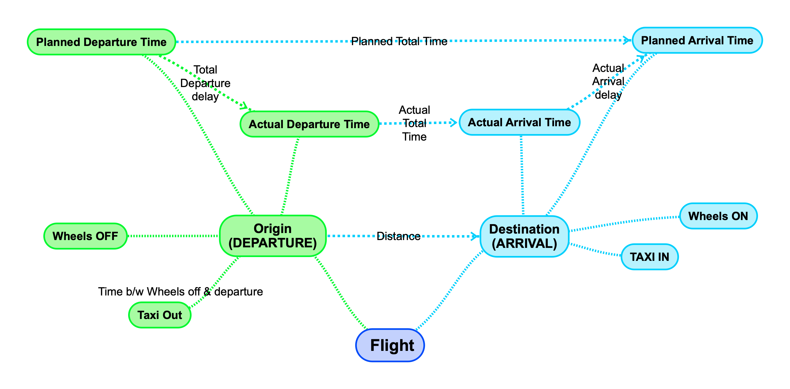
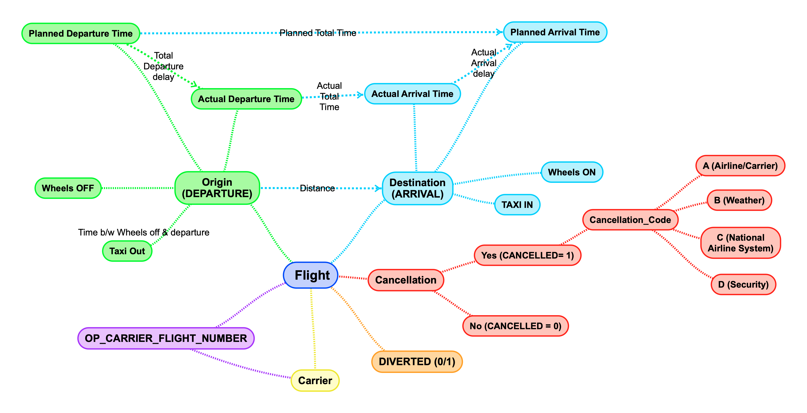
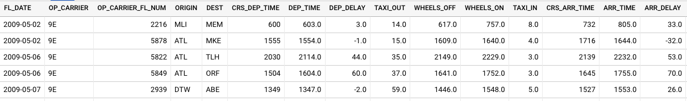
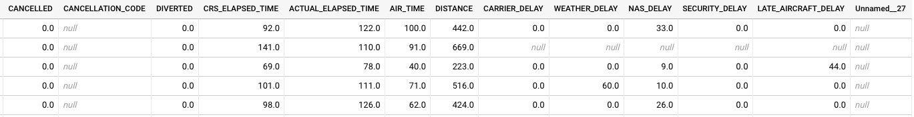
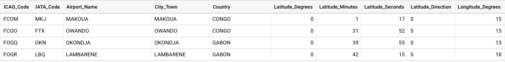

# About the Data:

An amalgamation of 2 datasets have been used to generate the insights.

- The main dataset has been sourced from <a target="_blank" href="https://www.kaggle.com">Kaggle</a>. Overall, the main dataset was nearly 7 GB in size with nearly 68 million rows.
- An additional dataset with the metadata for Global Aiports has been fetched from <a target="_blank" href="https://www.partow.net">Partow</a>. Only relevant information will be provided for the latter due to lesser importance.

## Fields Descripton    

- #### Airline Cancellation/Delay (2009-2018) dataset

**Name**|**Description**|**Type(Format)**|**Example**
:-----:|:-----:|:-----:|:-----:
FL\_DATE|Date of the flight|DATE (yy/mm/dd)|2009-05-02
OP\_CARRIER|Airline Identifier|STRING|9E
OP\_CARRIER\_FL\_NUM|Flight Number|INTEGER|2216
ORIGIN|Starting Airport Code (IATA Code)|STRING|MLI
DEST|Destination Airport Code (IATA Code)|STRING|MEM
CRS\_DEP\_TIME|Planned Departure Time|INTEGER|600
DEP\_TIME|Actual Departure Time|FLOAT|603.0
DEP\_DELAY|Total Delay on Departure in minutes|FLOAT|3.0 
TAXI\_OUT|The time duration elapsed between departure from the origin airport gate and wheels off|FLOAT|14.0 
WHEELS\_OFF|The time point that the aircraft's wheels leave the ground|FLOAT|617.0
WHEELS\_ON|The time point that the aircraft's wheels touch on the ground|FLOAT|757.0
TAXI\_IN|The time duration elapsed between wheels-on and gate arrival at the destination airport|FLOAT|8.0 
CRS\_ARR\_TIME|Planned arrival time|INTEGER|732
ARR\_TIME|Actual Arrival Time|FLOAT|805.0
ARR\_DELAY|Total Delay on Arrival in minutes|FLOAT|33.0 
CANCELLED|Flight Cancelled (1 = cancelled)|FLOAT|0.0
CANCELLATION\_CODE|Reason for Cancellation of flight: A - Airline/Carrier; B - Weather; C - National Air System; D - Security|STRING|D 
DIVERTED|Aircraft landed on airport that out of schedule|FLOAT|0.0
CRS\_ELAPSED\_TIME|Planned time amount needed for the flight trip|FLOAT|92.0 
ACTUAL\_ELAPSED\_TIME|AIR\_TIME+TAXI\_IN+TAXI\_OUT|FLOAT|122.0
AIR\_TIME|The time duration between wheels\_off and wheels\_on time|FLOAT|100.0 
DISTANCE|Distance between two airports|FLOAT|442.0
CARRIER\_DELAY|Delay caused by the airline in minutes|FLOAT|0.0 
WEATHER\_DELAY|Delay caused by weather|FLOAT|0.0
NAS\_DELAY|Delay caused by air system|FLOAT|33.0
SECURITY\_DELAY|Delay caused by security|FLOAT|0.0
LATE\_AIRCRAFT\_DELAY|Delay caused by aircraft reaching late|STRING|0.0

 
 

## Fields Graph:
- The following shows the relation between columns:

 

    
Complete Fields Graph

        

 

-   ## The Global Airport Database dataset:

**Name**|**Type**|**Example**
:-----:|:-----:|:-----:
ICAO Code |(3-4 chars, A - Z)|KATL
IATA Code |(3 chars, A - Z)|ATL
Airport Name |String|THE WILLIAM B HARTSFIELD ATLANTA INTERNATIONAL
City/Town |String|ATLANTA
Country |String|USA
Latitude Degrees |Integer [0,360]|33
Latitude Minutes |Integer [0,60]|38
Latitude Seconds |Integer [0,60]|25
Latitude Direction |Char (N or S)|N
Longitude Degrees |Integer [0,360]|84
Longitude Minutes |Integer [0,60]|25
Longitude Seconds |Integer [0,60]|37
Longitude Direction |Char (E or W)|W
Altitude (Altitude in meters from mean sea level)|Integer [-99999,+99999]|313
Latitude Decimal Degrees |Floating point [-90,90]|33.64
Longitude Decimal Degrees|Floating point [-180,180]|-84.427

 
 

### Fields Data Preview

    
Main Dataset

     
    Set 1: 15/27 columns
     
     
    
     
     
    Set 2: Remaining 12/27 columns
     
     
    

 

    
Auxillary Dataset

         
        

 

    

        
    

    
 
        
    

