<style>
	pre.highlight{
		font-size: 10px;
	}
</style>
# Data Analysis:

While going through the variables of the dataset, it was realized that the solutions for the following questions could be obtained by analyzing the dataset:

-  What are the major busiest airports with maximum flight arrival count?
-  What are the major reasons for delays and cancellations at the busiest airports?
-  Is the major reason for flight delays same as the major reason for cancellations?
-  Is there a specific period (specific months) when delays and cancellations happened the most?
-  Is the amount of delays and cancellations distributed equally nationwide.? If not, which regions are majorly affected.?

---

An in-depth analysis was carried out to obtain the following insights from the data.
- We will analyze the data based on count, date and time frequency for granualar analysis.

---

## Flight count from Top 5 Airlines at Top 5 Airports

> ###### Query
```
WITH top_5_airports AS (
	SELECT ORIGIN, COUNT(ORIGIN) AS count
	FROM
		airline-delay-canc.airlines_data.delay_canc_data
	GROUP BY
		1
	HAVING
		count > 100000
	ORDER BY
		2 DESC
	LIMIT 5
),
top_5_airlines AS (
	SELECT
		OP_CARRIER,
		COUNT(OP_CARRIER) AS count
	FROM
		airline-delay-canc.airlines_data.delay_canc_data main,
		top_5_airports top5
	WHERE
		top5.ORIGIN = main.ORIGIN
	GROUP BY
		1
	ORDER BY
		2 DESC
	LIMIT 5
),
airportwise_carrier_cnt AS (
	SELECT
		main.ORIGIN AS Airport,
		main.OP_CARRIER AS Carrier,
		COUNT(*) AS count
	FROM
		airline-delay-canc.airlines_data.delay_canc_data main,
		top_5_airports top5_ap,
		top_5_airlines top_al
	WHERE
		top5_ap.ORIGIN = main.ORIGIN
		AND top_al.OP_CARRIER = main.OP_CARRIER
	GROUP BY
		1,
		2
),
resut_cte AS (
	SELECT
		Airport,
		Carrier,
		count,
		RANK() OVER (PARTITION BY Airport ORDER BY count) AS rank
	FROM
		airportwise_carrier_cnt
)
SELECT
	Airport,
	Carrier,
	count
FROM
	resut_cte
WHERE
	rank < 6
```

###### Results
#### Top 5 Airports with maximum flight count:

1. **ORD** (O'Hare International Airport)
2. **ATL** (Hartsfield-Jackson Atlanta International Airport)
3. **DFW** (Dallas/Fort Worth International Airport)
4. **LAX** (Los Angeles International Airport)
5. **DEN** (Denver International Airport)


#### Top 5 Airlines with maximum flight count:
1. **DL** (Delta Air Lines)
2. **AA** (American Airlines)
3. **UA** (United Airlines)
4. **OO** (SkyWest Airlines)
5. **MQ** (American Eagle Airlines)

<a href="images/1_five_busiest_airport_airline.png">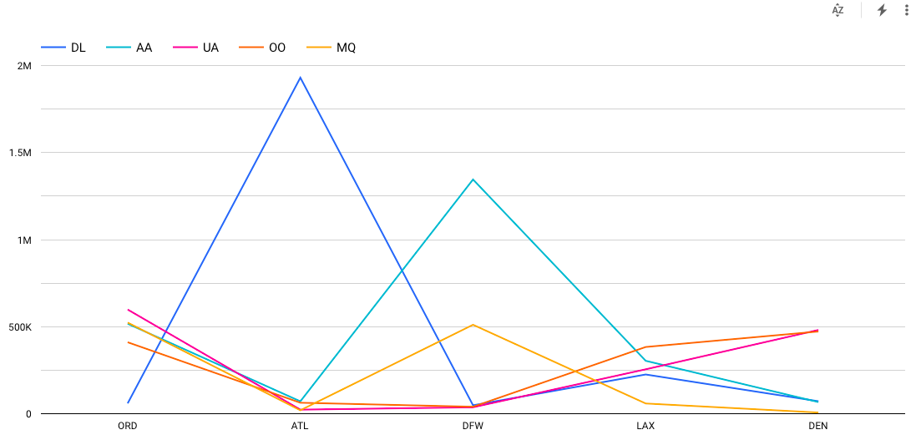</a>

<br>

- From the above, it is realized that on **Delta Airlines** has the highest flight frequence on the **Atlanta** airport.

<br>

## Top 5 Airports with Maximum Cancellations (decreasing order)

> ###### Query
```
WITH
  top_5_airports AS (
  SELECT
    ORIGIN,
    COUNT(ORIGIN) AS count
  FROM
    `airline-delay-canc.airlines_data.delay_canc_data`
  GROUP BY
    1
  ORDER BY
    2 DESC
  LIMIT
    5 ),
  top_5_airlines AS (
  SELECT
    OP_CARRIER,
    COUNT(OP_CARRIER) AS count
  FROM
    `airline-delay-canc.airlines_data.delay_canc_data` main,
    top_5_airports top5
  WHERE
    top5.ORIGIN = main.ORIGIN
  GROUP BY
    1
  ORDER BY
    2 DESC
  LIMIT
    5),
  all_flights AS (
  SELECT
    main.ORIGIN AS Airport,
    main.OP_CARRIER AS Carrier,
    COUNT(*) AS all_cnt
  FROM
    `airline-delay-canc.airlines_data.delay_canc_data` main,
    top_5_airports top5_ap,
    top_5_airlines top_al
  WHERE
    top5_ap.ORIGIN = main.ORIGIN
    AND top_al.OP_CARRIER = main.OP_CARRIER
  GROUP BY
    1,
    2 ),
  cancelled_flights AS (
  SELECT
    main.ORIGIN AS Airport,
    main.OP_CARRIER AS Carrier,
    COUNT(*) AS cancelled_cnt
  FROM
    `airline-delay-canc.airlines_data.delay_canc_data` main,
    top_5_airports top5_ap,
    top_5_airlines top_al
  WHERE
    top5_ap.ORIGIN = main.ORIGIN
    AND top_al.OP_CARRIER = main.OP_CARRIER
    AND cancelled = 1
  GROUP BY
    1,
    2 )
SELECT
  af.Airport,
  af.Carrier,
  af.all_cnt - cf.cancelled_cnt AS all_cnt,
  cf.cancelled_cnt
FROM
  all_flights af,
  cancelled_flights cf
WHERE
  af.Airport = cf.Airport
  AND af.Carrier = cf.Carrier
```

###### Results

| S No.| Airport Code | Airport Name | Cancellation (in %) |
| - | - | - | - | -
| 1. | **ORD** | (O'Hare International Airport) | 39|
| 2. | **DFW** | (Dallas/Fort Worth International Airport) | 28.5|
| 3. | **ATL** | (Hartsfield-Jackson Atlanta International Airport) | 14.9|
| 4. | **DEN** | (Denver International Airport) | 9.8|
| 5. | **LAX** | (Los Angeles International Airport) | 7.9|


<a href="images/2_Cancellations_Pie_Chart.png">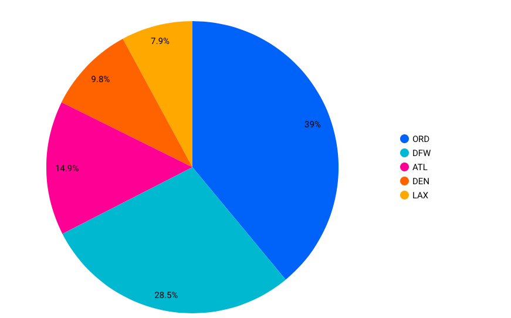</a>

<br><br>

#### Airline-wise Cancellation Bifurcation
<br>
<a href="images/3_Cancellation_bifurcation.png">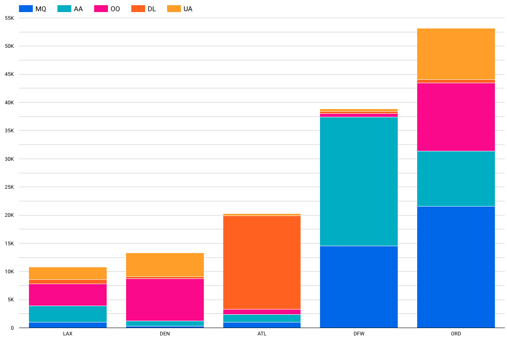</a>

<br>
<br>

---

## Top Cancellation Reasons for Top 5 Busiest Airports

> ###### Query - JS UDF Function
```
CREATE TEMP FUNCTION
  cancellation_reason(code string)
  RETURNS string
  LANGUAGE js AS """
    switch(code) {
        case "A":
          return "Airline/Carrier";
        break;
        case "B":
          return "Weather";
        break;
        case "C":
          return "National Air System";
        break;
        case "D":
          return "Security";
        break;
        default:
          return "Others";
        break;
   }
""";
WITH
  top_5_airports AS (
  SELECT
    ORIGIN,
    COUNT(ORIGIN) AS count
  FROM
    `airline-delay-canc.airlines_data.delay_canc_data`
  GROUP BY
    1
  HAVING
    count > 100000
  ORDER BY
    2 DESC
  LIMIT
    5 )
SELECT
  top5.ORIGIN,
  cancellation_reason(main.CANCELLATION_CODE) AS reason,
  COUNT(main.CANCELLATION_CODE) AS count
FROM
  `airline-delay-canc.airlines_data.delay_canc_data` main,
  top_5_airports top5
WHERE
  CANCELLED = 1
  AND EXTRACT(year
  FROM
    FL_DATE) = 2018
  AND top5.ORIGIN = main.ORIGIN
GROUP BY
  1,
  2
ORDER BY
  1,
  2
```

###### Result

| S No.| Reason | Cancellation (in %) |
| - | - | - | -
| 1. | **Weather** | 53.7|
| 2. | **Airline/Carrier Delays** | 25.4|
| 3. | **National Air System** | 20.9|
| 4. | **Airport Secutiy** | 0.01 (~ 0)|

<br>
<br>
<a href="images/7_Cancellation_Reason_bifurcation.png">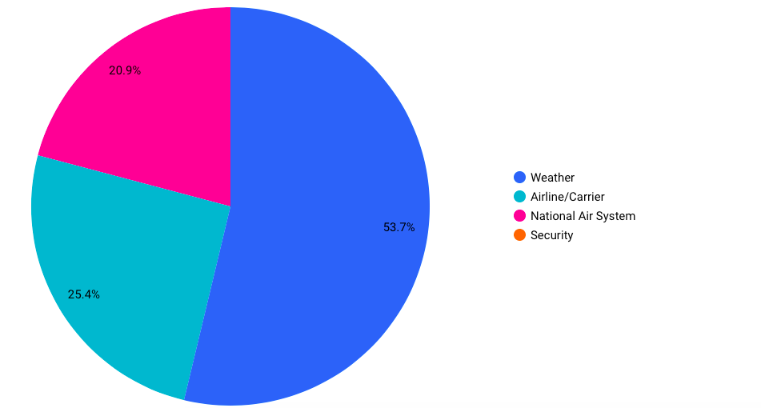</a>

<br>
<br>
<br>

### Top Cancellation Reasons at the Most Busiest Airport in practice (Atlanta)
- Atlanta is one of the largest inter-connect point (airport) for domestic and international flights in USA.

|S No.| Reason | Cancellation (in %) |
| - | - | - | -
| 1. | **Weather** | 74.6|
| 2. | **Airline/Carrier Delays** | 17.4|
| 3. | **National Air System** | 8|

<br>

<a href="images/8_Cancellation_Reason_top_airport_ATL.png">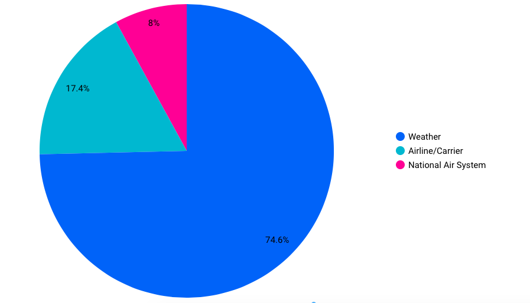</a>

<br>
<br>

---
## Next, we look at the delays
---

### Overall Delays at Top 5 Airports for top 5 airlines

> ###### Query
```
WITH
  top_5_airports AS (
  SELECT
    ORIGIN,
    COUNT(ORIGIN) AS count
  FROM
    `airline-delay-canc.airlines_data.delay_canc_data`
  GROUP BY
    1
  ORDER BY
    2 DESC
  LIMIT
    5 ),
  top_5_airlines AS (
  SELECT
    OP_CARRIER,
    COUNT(OP_CARRIER) AS count
  FROM
    `airline-delay-canc.airlines_data.delay_canc_data` main,
    top_5_airports top5
  WHERE
    top5.ORIGIN = main.ORIGIN
  GROUP BY
    1
  ORDER BY
    2 DESC
  LIMIT
    5),
  all_flights AS (
  SELECT
    main.ORIGIN AS Airport,
    main.OP_CARRIER AS Carrier,
    COUNT(*) AS all_cnt
  FROM
    `airline-delay-canc.airlines_data.delay_canc_data` main,
    top_5_airports top5_ap,
    top_5_airlines top_al
  WHERE
    top5_ap.ORIGIN = main.ORIGIN
    AND top_al.OP_CARRIER = main.OP_CARRIER
  GROUP BY
    1,
    2 ),
  delayed_flights AS (
  SELECT
    main.ORIGIN AS Airport,
    main.OP_CARRIER AS Carrier,
    COUNT(*) AS delayed_cnt
  FROM
    `airline-delay-canc.airlines_data.delay_canc_data` main,
    top_5_airports top5_ap,
    top_5_airlines top_al
  WHERE
    top5_ap.ORIGIN = main.ORIGIN
    AND top_al.OP_CARRIER = main.OP_CARRIER
    AND (CARRIER_DELAY IS NOT NULL
      AND CARRIER_DELAY > 0
      OR ARR_DELAY IS NOT NULL
      AND ARR_DELAY > 0)
  GROUP BY
    1,
    2 )
SELECT
  af.Airport,
  af.Carrier,
  af.all_cnt all_with_del,
  df.delayed_cnt,
  af.all_cnt - df.delayed_cnt AS all_without_del
FROM
  all_flights af,
  delayed_flights df
WHERE
  af.Airport = df.Airport
  AND af.Carrier = df.Carrier
```

<br>

#### Overall Delays at Top 5 Airports with top 5 airlines


<a href="images/4_Delay_bifurcation.png">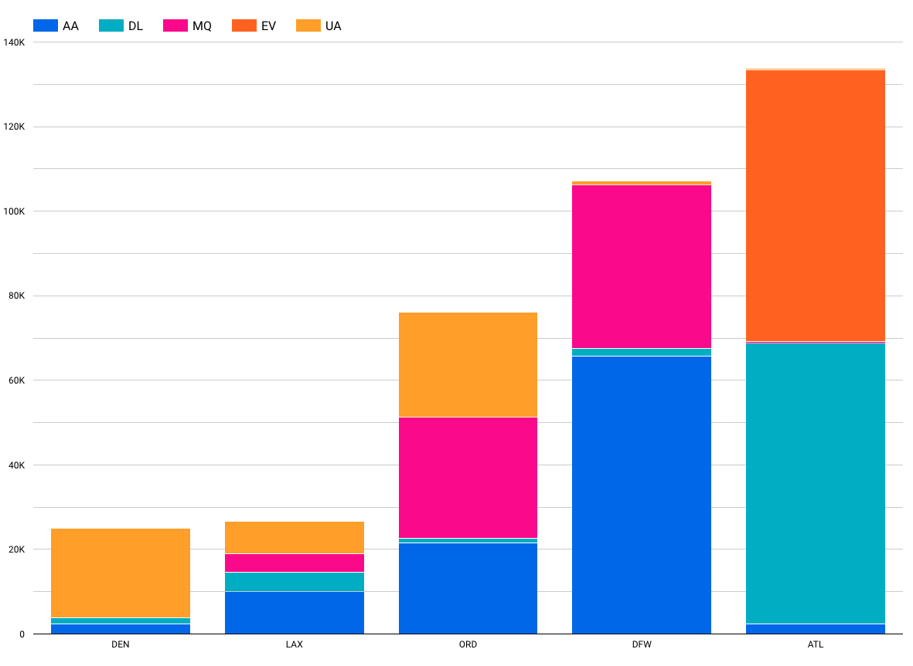</a>
 
<br>

---
> ### Next we find out the time period with maximum delays and cancellations together.

---

<br>

## Overall Cancellation/Delays Yearwise

> ###### Query
```
WITH
  cancellation_data AS (
  SELECT
    EXTRACT(year
    FROM
      FL_DATE) AS year,
    COUNT(*) AS cancellation_cnt
  FROM
    `airline-delay-canc.airlines_data.delay_canc_data`
  WHERE
    CANCELLED = 1
  GROUP BY
    year
  ORDER BY
    year ),
  delayed_data AS (
  SELECT
    EXTRACT(year
    FROM
      FL_DATE) AS year,
    COUNT(*) AS delay_cnt
  FROM
    `airline-delay-canc.airlines_data.delay_canc_data`
  WHERE
    (CARRIER_DELAY IS NOT NULL
      AND CARRIER_DELAY > 0
      OR ARR_DELAY IS NOT NULL
      AND ARR_DELAY > 0)
  GROUP BY
    year
  ORDER BY
    year )
SELECT
  c.year,
  c.cancellation_cnt,
  d.delay_cnt
FROM
  cancellation_data c,
  delayed_data d
WHERE
  c.year = d.year
ORDER BY
  c.year
```
#### Overall Cancellation/Delays Yearwise

<a href="images/5_yearwise_delays_cancalltions.png">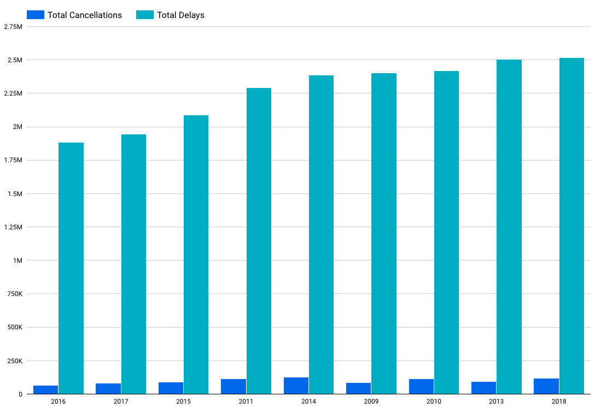</a>

<br>

> We realize that 2018 is the year of maximum delays and cancellations

<br>

## Overall Yearwise Cancellations Count

|S No.| Year | Cancellations (in thousand) |
| - | - | - | -
| 1. |2009 | 87 |
| 2. | 2010 | 113|
| 3. |2011| 116|
| 4. |2012|93|
| 5. |2013 | 96|
| 6. |2014 | 126|
| 7. |2015 | 89|
| 8. |2016 | 65|
| 9. |2017 | 82|
| 10. |2018 | 116|

<br>
<a href="images/6_yearwise_cancalltions.png">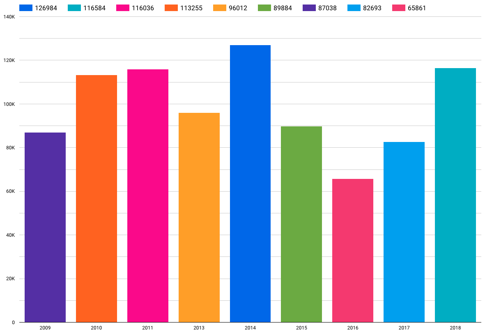</a>


## Overall Delay Time Frequency with Top 5 Airports (2009-2018)

> ###### Query

```
CREATE TEMP FUNCTION delay_bifurcation(slot_cnt ARRAY<STRUCT<slot int64,count int64>>)
   RETURNS STRUCT<cnt_1_30 float64, cnt_30_2 float64, cnt_2_5 float64, cnt_5_24 float64, cnt_24 float64>
  LANGUAGE js AS """
  let response = {"cnt_1_30": 0.0, "cnt_30_2": 0.0, "cnt_2_5": 0.0, "cnt_5_24": 0.0, "cnt_24": 0.0}
  for(let i = 0 ; i < slot_cnt.length; i++){
      let slotCntObj = slot_cnt[i];
      let result =   slotCntObj.count;
      switch(parseInt(slotCntObj.slot)){
        case 1:
          response["cnt_1_30"] =  result;
          break;
        case 2:
          response["cnt_30_2"] = result;
          break;
        case 3:
          response["cnt_2_5"] = result;
          break;
        case 4:
          response["cnt_5_24"] = result;
          break;
        case 5:
          response["cnt_24"] = result;
          break;
        default:
          response["cnt_1_30"] = 0.0;
          response["cnt_30_2"] = 0.0;
          response["cnt_2_5"] = 0.0;
          response["cnt_5_24"] = 0.0;
          response["cnt_24"] = 0.0;
          break;
      }
    }
    return response
""";

WITH top_5_airports as (
      SELECT ORIGIN, count(ORIGIN) as count
      FROM `airline-delay-canc.airlines_data.delay_canc_data`
      Group by 1
      having count > 100000
      order by 2 desc
      limit 5
      ),
    delay_bifurcation as (
      select ORIGIN,
          (case when ARR_DELAY > 1440 then 5
             when ARR_DELAY > 300 then 4
             when ARR_DELAY > 240 then 3
             when ARR_DELAY > 30 then 2
        else 1 end) as slot

  from `airline-delay-canc.airlines_data.delay_canc_data`
  where ARR_DELAY is not null and ARR_DELAY > 0
--   and EXTRACT(year FROM FL_DATE) = 2018
  ),

  airport_timeslots as(
  select db.ORIGIN, db.slot, count(db.slot) as count
  from delay_bifurcation db,top_5_airports top5
  where top5.ORIGIN = db.ORIGIN
  group by 1,2),

  airport_struct as(
      select origin, struct(slot,count) as slot_cnt from  airport_timeslots
  ),
  udf_result as (select origin, delay_bifurcation(ARRAY_AGG(slot_cnt)) as slot_struct
  from airport_struct
  group by 1
  )
  select origin, slot_struct.cnt_1_30 as cnt_1_30min,
      slot_struct.cnt_30_2 as cnt_30min_2hr,
      slot_struct.cnt_2_5 as cnt_2_5hr,
      slot_struct.cnt_5_24 as cnt_5hr_1d,
      slot_struct.cnt_24 as cnt_1d_more
  from udf_result
```

#### Overall Delay Time Frequency with Top 5 Airports (UDF Function)

<a href="images/8_Overall_delays_cnt.png"></a>

<br>

#### Overall Delay Frequency for 2018 (Year with max delays and cancellations)

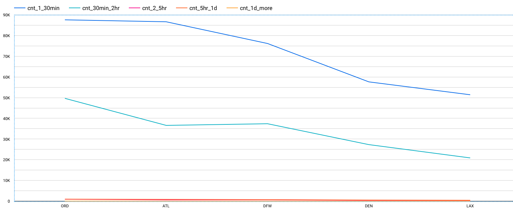

---

## Delay Percentage for top 5 airports (2009-2018)

> ###### Query

```
CREATE TEMP FUNCTION delay_bifurcation(slot_cnt ARRAY<STRUCT<slot int64,count int64>>)
   RETURNS STRUCT<cnt_1_30 float64, cnt_30_2 float64, cnt_2_5 float64, cnt_5_24 float64, cnt_24 float64>
  LANGUAGE js AS """

  let response = {"cnt_1_30": 0.0, "cnt_30_2": 0.0, "cnt_2_5": 0.0, "cnt_5_24": 0.0, "cnt_24": 0.0}
  let total_delayed_flights = 0;
  for(let i = 0 ; i < slot_cnt.length; i++){
    total_delayed_flights += parseInt(slot_cnt[i].count);
  }
  for(let i = 0 ; i < slot_cnt.length; i++){
      let slotCntObj = slot_cnt[i];
      let result =   parseFloat(parseInt(slotCntObj.count) / total_delayed_flights * 100).toFixed(2);
      switch(parseInt(slotCntObj.slot)){
        case 1:
          response["cnt_1_30"] =  result;
          break;
        case 2:
          response["cnt_30_2"] = result;
          break;
        case 3:
          response["cnt_2_5"] = result;
          break;
        case 4:
          response["cnt_5_24"] = result;
          break;
        case 5:
          response["cnt_24"] = result;
          break;
        default:
          response["cnt_1_30"] = 0.0;
          response["cnt_30_2"] = 0.0;
          response["cnt_2_5"] = 0.0;
          response["cnt_5_24"] = 0.0;
          response["cnt_24"] = 0.0;
          break;
      }
    }
    return response
""";

WITH top_5_airports as (
      SELECT ORIGIN, count(ORIGIN) as count
      FROM `airline-delay-canc.airlines_data.delay_canc_data`
      Group by 1
      having count > 100000
      order by 2 desc
      limit 5
      ),
    delay_bifurcation as (
      select ORIGIN,
          (case when ARR_DELAY > 1440 then 5
             when ARR_DELAY > 300 then 4
             when ARR_DELAY > 240 then 3
             when ARR_DELAY > 30 then 2
        else 1 end) as slot

  from `airline-delay-canc.airlines_data.delay_canc_data`
  where ARR_DELAY is not null and ARR_DELAY > 0

--   and EXTRACT(year FROM FL_DATE) = 2018 -- used for filtering
  ),

  airport_timeslots as(
  select db.ORIGIN, db.slot, count(db.slot) as count
  from delay_bifurcation db,top_5_airports top5
  where top5.ORIGIN = db.ORIGIN
  group by 1,2),

  airport_struct as(
      select origin, struct(slot,count) as slot_cnt from  airport_timeslots
  ),
  udf_result as (select origin, delay_bifurcation(ARRAY_AGG(slot_cnt)) as slot_struct
  from airport_struct
  group by 1
  )
  select origin, slot_struct.cnt_1_30 as prcnt_1_30min,
      slot_struct.cnt_30_2 as prcnt_30min_2hr,
      slot_struct.cnt_2_5 as prcnt_2_5hr,
      slot_struct.cnt_5_24 as prcnt_5hr_1d,
      slot_struct.cnt_24 as prcnt_1d_more
  from udf_result

```

#### Delay Percentage for top 5 airports (2009-2018)

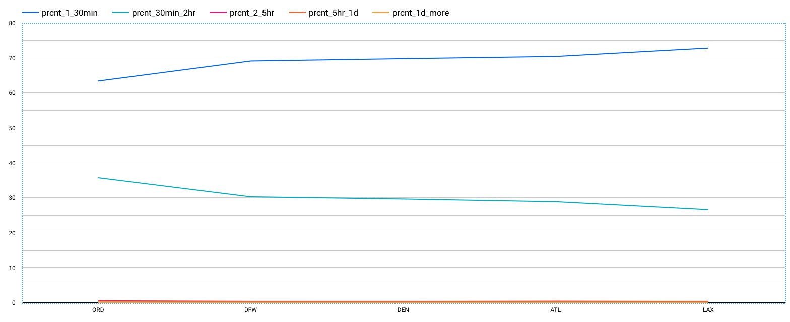

---

#### Delay Percentage for top 5 airports (2018) 


---
## Let us get into some more details in 2018
---

### Most unreliable month of 2018 (Cancellations in ascending order)

> ###### Query
```
WITH
  cancelled_count_cte AS (
  SELECT
    *,
    ROW_NUMBER() OVER (ORDER BY cancelled_count) AS RANK
  FROM (
    SELECT
      FORMAT_DATE('%B', FL_DATE) AS month,
      SUM(CANCELLED) AS cancelled_count
    FROM
      `airline-delay-canc.airlines_data.delay_canc_data`
    WHERE
      EXTRACT(year
      FROM
        FL_DATE) = 2018
    GROUP BY
      1) )
SELECT
  month,
  cancelled_count
FROM
  cancelled_count_cte
ORDER BY
  rank DESC
```

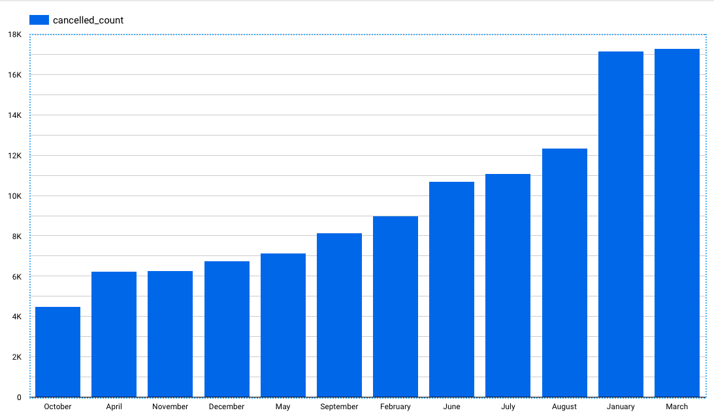

 
<div class="parent" style="display: inline-block;width: 100%;">
    <div class="header3" style="display: inline;float: left;width: 50%;">
        <a href="requirements"></a>
    </div>
    <div style="text-align: right;display: inline;cursor:pointer;float: right;right: -6px;" align="right"> 
        <a href="summary"></a>
    </div>
</div>