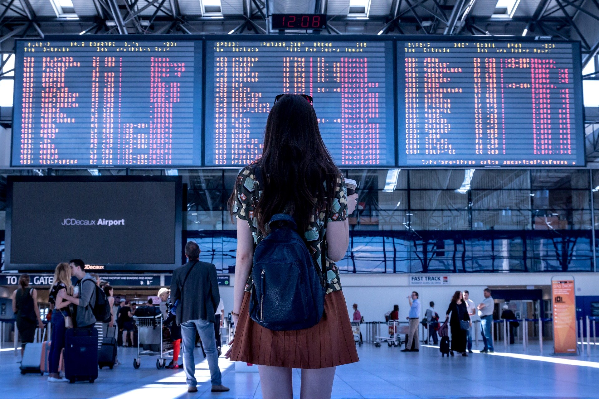

    

        <h1 id="kaggle-airline-delay--cancellation-analysis">{{site.title}}</h1>
    

    
 
        
    

{{site.description_detail}}

Image by <a target="_blank" href="https://pixabay.com/users/JESHOOTS-com-264599/?utm_source=link-attribution&amp;utm_medium=referral&amp;utm_campaign=image&amp;utm_content=2373727">Jan Vašek</a> from <a href="https://pixabay.com/?utm_source=link-attribution&amp;utm_medium=referral&amp;utm_campaign=image&amp;utm_content=2373727">Pixabay</a>

